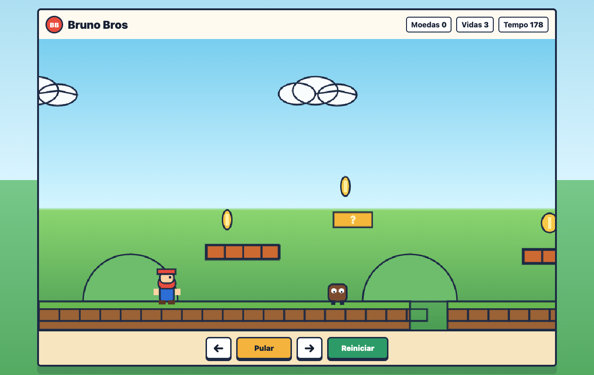
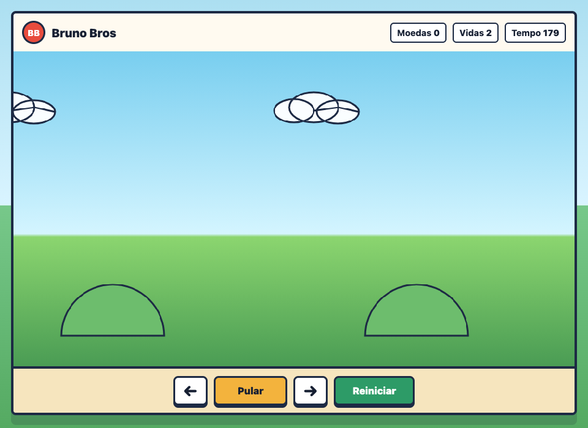

🌌 Neon Rift

🌌 Neon Rift

⚡ Cyberpunk Platform Game Experience ⚡

🎮 Relatório de Entrega • Documentação Oficial do Projeto

Uma experiência de plataforma futurista desenvolvida em JavaScript puro,
com combate dinâmico, HUD neon, partículas, efeitos visuais e gameplay arcade.

 

⸻

📋 Sumário

* 📖 Sobre o Projeto
* 🎯 Objetivo
* 🧠 Conceitos Aplicados
* 🕹️ Funcionalidades
* 🎨 Interface e Design
* ⚙️ Estrutura do Projeto
* 🧩 Arquitetura do Sistema
* 🚀 Tecnologias Utilizadas
* 🎮 Controles
* 📂 Estrutura de Pastas
* 🖼️ Preview do Projeto
* 🔥 Diferenciais
* 📈 Resultado Final
* ▶️ Como Executar
* 👨‍💻 Autor

⸻

📖 Sobre o Projeto

O Neon Rift é um jogo de plataforma 2D inspirado em universos cyberpunk e arcades futuristas. O projeto foi desenvolvido utilizando apenas tecnologias web nativas, explorando renderização em Canvas, gerenciamento de entidades, sistema de partículas, áudio procedural e mecânicas modernas de gameplay.

O jogo apresenta uma experiência dinâmica com:

* ⚔️ Sistema de combate
* 🔫 Disparos de energia
* ⚡ Dash energético
* 💥 Explosões especiais
* 🌆 Cenários neon cyberpunk
* 🎵 Áudio sintetizado em navegador
* 📸 Screen Shake cinematográfico
* ✨ Partículas visuais
* 🧠 Sistema de colisão e física

⸻

🎯 Objetivo

O objetivo principal do projeto foi construir uma experiência completa de jogo utilizando JavaScript puro, sem frameworks externos, focando em:

* Desenvolvimento de lógica de jogos
* Estruturação de engine 2D
* Organização modular de código
* Renderização gráfica via Canvas
* Sistemas de input e física
* Criação de efeitos visuais modernos
* Experiência arcade responsiva

⸻

🧠 Conceitos Aplicados

🔹 Programação Modular

O sistema foi dividido em múltiplos módulos responsáveis por diferentes áreas da aplicação.

🔹 Game Loop

Utilização de loop contínuo baseado em requestAnimationFrame() para renderização fluida.

🔹 Sistema de Entidades

Gerenciamento de jogador, inimigos, projéteis e partículas.

🔹 Colisão e Física

Implementação de detecção de colisão e movimentação dinâmica.

🔹 Renderização Canvas

Toda a renderização gráfica é feita utilizando HTML5 Canvas.

🔹 Input System

Captura de teclado e controles mobile.

⸻

🕹️ Funcionalidades

⚔️ Combate

* Ataques corpo a corpo
* Sistema de dano
* Inimigos interativos
* Feedback visual de impacto

🔫 Sistema de Tiros

* Disparo de projéteis energéticos
* Física de movimentação
* Colisão dinâmica

⚡ Dash Energético

* Movimentação rápida
* Consumo de energia
* Efeito visual neon

💥 Explosão Especial

* Ataque de área
* Partículas visuais
* Screen shake

❤️ HUD Dinâmica

* Barra de vida
* Barra de energia
* Sistema de pontuação
* Nome da fase

🌆 Sistema de Fases

* Múltiplos cenários
* Progressão de gameplay
* Layouts personalizados

📱 Compatibilidade Mobile

* Controles touch integrados
* Layout responsivo
* Jogabilidade adaptada

⸻

🎨 Interface e Design

O projeto utiliza uma identidade visual inspirada em:

* 🌃 Cyberpunk
* 🎮 Arcades retrô
* ⚡ Interfaces neon futuristas
* 💻 Jogos sci‑fi

Características Visuais

* HUD neon translúcida
* Efeitos de brilho
* Partículas energéticas
* Explosões estilizadas
* Screen shake cinematográfico
* Feedback visual de combate

⸻

⚙️ Estrutura do Projeto

NeonRift/
│
├── assets/
│   └── sprites e imagens
│
├── src/
│   ├── audio.js
│   ├── config.js
│   ├── entities.js
│   ├── game.js
│   ├── input.js
│   └── renderer.js
│
├── index.html
├── styles.css
├── preview.png
└── README.md

⸻

🧩 Arquitetura do Sistema

🎮 game.js

Responsável pela lógica principal do jogo:

* Loop principal
* Atualizações de estado
* Gerenciamento de fases
* Atualização do HUD
* Controle geral do gameplay

🎨 renderer.js

Responsável pela renderização gráfica:

* Cenários
* Entidades
* Partículas
* Interface
* Efeitos visuais

👾 entities.js

Gerenciamento de entidades:

* Jogador
* Inimigos
* Colisões
* Física
* Projéteis

🎵 audio.js

Sistema de áudio procedural:

* Sons sintetizados
* Feedback sonoro
* Efeitos de combate

🎮 input.js

Captura de inputs:

* Teclado
* Mobile touch
* Eventos de ação

⸻

🚀 Tecnologias Utilizadas

Tecnologia	Função
HTML5	Estrutura da aplicação
CSS3	Estilização visual
JavaScript ES6	Lógica do jogo
Canvas API	Renderização gráfica
Web Audio API	Sistema de áudio

⸻

🎮 Controles

Ação	Controle
Mover	A / D ou ← →
Pular	Espaço
Atacar	J
Atirar	K
Dash	Shift
Explosão Especial	L

⸻

🖼️ Preview do Projeto

🌃 Gameplay Preview

📱 Mobile Layout

⸻

🔥 Diferenciais do Projeto

⚡ Alta Interatividade

Gameplay responsivo e fluido.

🎨 Visual Cyberpunk

Interface moderna e estilizada.

🧠 Código Modular

Projeto organizado em módulos reutilizáveis.

📱 Mobile Friendly

Compatibilidade com dispositivos móveis.

🎵 Áudio Dinâmico

Sistema sonoro procedural integrado.

✨ Efeitos Visuais

Partículas, explosões e efeitos cinematográficos.

⸻

📈 Resultado Final

O projeto entrega uma experiência completa de jogo arcade futurista utilizando apenas tecnologias web nativas, demonstrando domínio em:

* Desenvolvimento Front-End
* Estruturação de projetos
* JavaScript avançado
* Canvas API
* Game Development
* Organização arquitetural
* Sistemas interativos

⸻

▶️ Como Executar

📥 Clone o repositório

git clone https://github.com/SEU-USUARIO/SEU-REPOSITORIO.git

📂 Acesse a pasta

cd NeonRift

🚀 Execute

Abra o arquivo:

index.html

no navegador.

⸻

🧪 Funcionalidades Testadas

✅ Sistema de movimentação

✅ Sistema de colisão

✅ Sistema de ataque

✅ Sistema de tiro

✅ Dash energético

✅ Explosão especial

✅ Renderização Canvas

✅ Compatibilidade desktop

✅ Compatibilidade mobile

✅ HUD dinâmica

⸻

👨‍💻 Autor

Matheus Oliveira

Full Stack Developer • Game Enthusiast • Automation Developer

“Code Beyond Limits.”

⸻

🚀 Neon Rift

Cyberpunk Platform Experience

⚡ Desenvolvido com JavaScript • HTML5 • Canvas API ⚡

